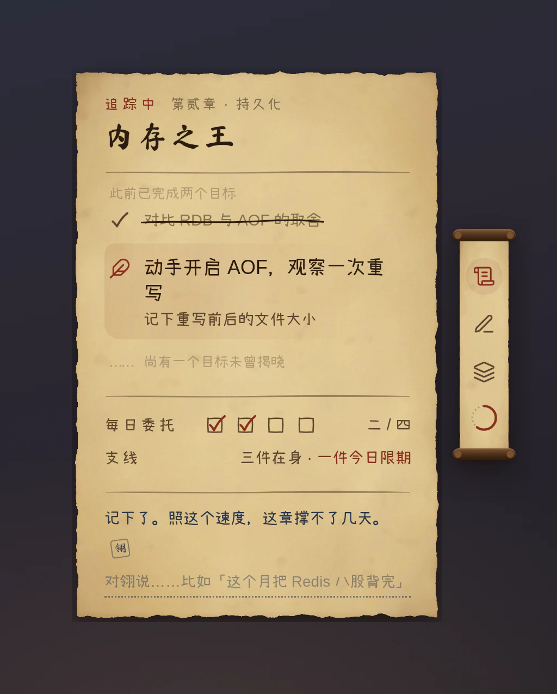
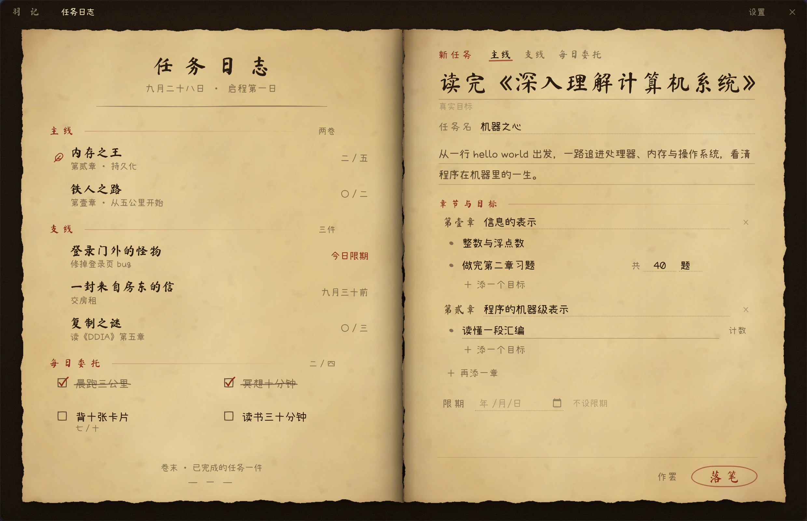
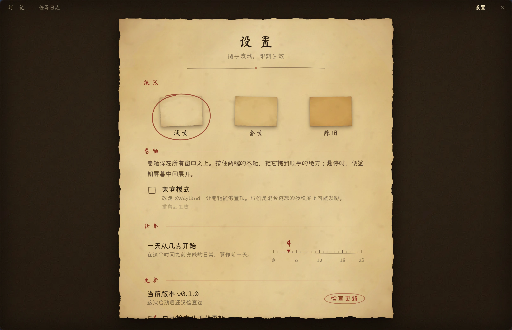
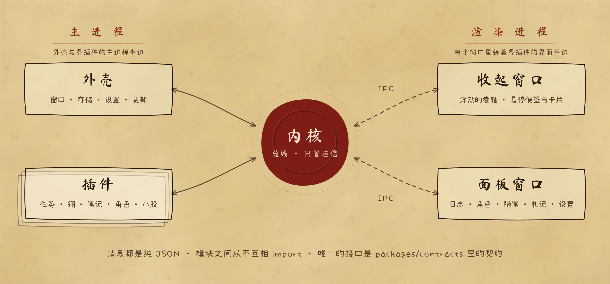

<div align="center">


# 羽记 · Featherlog

**把日子过成一场冒险。**<br/>
一本羊皮纸任务日志，收在桌面边上的一只小卷轴里。

[](https://github.com/muyuzhong/Featherlog/releases/latest)
[](https://github.com/muyuzhong/Featherlog/actions/workflows/ci.yml)
[](#下载安装)
[](LICENSE)

[下载](https://github.com/muyuzhong/Featherlog/releases/latest) · [设计文档](docs/design.md) · [参与开发](#开发)

<br/>


</div>

<br/>

## 不是待办清单，是任务

待办清单只会越列越长。羽记借用了游戏里"任务"的样子：同一时间只追踪一件事，眼前只摆着**下一步**。

- **主线**：一条任务线，分成若干章，每章若干目标，**按顺序一个个解锁**。还没走到的部分藏在"尚未揭晓"后面。
- **支线**：一件单独的事，可以拆几步，也可以就是一件事。
- **每日委托**：每天（或每周几）重来一次的习惯，可以设配额，比如"背十张卡片"。
- **追踪**：给一个任务盖上火漆，它的当前目标就会出现在卷轴里。
- **仪式感**：一章写完有横幅，一个任务完成时会盖下朱印「功成」。

每个任务都有一个**真实目标**（"背完 Redis 八股"），也可以起一个**任务名**（"内存之王"）、写几句**简报**。

<table>
  <tr>
    <td width="36%" valign="top">
      
      <p align="center"><b>浮动的卷轴</b><br/><sub>置顶在屏幕边上，拖到哪里都行。<br/>悬停时朝屏幕中间展开便签，<br/>点一下翻开日志。</sub></p>
    </td>
    <td width="64%" valign="top">
      
      <p align="center"><b>在日志里落笔</b><br/><sub>新建和修订都在右页进行，排版就是它将来被读到的样子。<br/>回车起新目标，修订不丢进度。</sub></p>
      
      <p align="center"><b>一张设置散页</b><br/><sub>三种纸张、一天从几点开始、自动更新。</sub></p>
    </td>
  </tr>
</table>

## 下载安装

从 [**Releases**](https://github.com/muyuzhong/Featherlog/releases/latest) 下载对应的安装包：

| 系统 | 安装包 | 自动更新 |
|---|---|---|
| **Linux** x64 | `Featherlog-<版本>-x86_64.AppImage`，加上执行权限后直接运行 | ✅ 后台下载，退出时安装 |
| **Windows** x64 | `Featherlog-<版本>-x64.exe`，按用户安装，不需要管理员权限 | ✅ 后台下载，退出时安装 |
| **macOS** | Apple 芯片选 `arm64`，Intel 选 `x64`（`.dmg`） | 有新版本时提示前往下载 |
| **Arch Linux** | 仓库里的 PKGBUILD，见下方 | 跟着包管理器更新 |

**AppImage 的 FUSE 依赖**：若运行时报 `libfuse.so.2` 缺失，只有 FUSE 3 还不够；Arch Linux 可安装兼容库 `sudo pacman -S fuse2`，保留现有 FUSE 3。也可以执行 `./Featherlog-<版本>-x86_64.AppImage --appimage-extract-and-run`，或使用下方无需 FUSE 的 PKGBUILD。其他发行版见 [AppImage 官方 FUSE 排错说明](https://docs.appimage.org/user-guide/troubleshooting/fuse.html)。

**Arch Linux**：AUR 目前暂停了新账号注册，上架之前可以直接用仓库里的 PKGBUILD 构建安装。它从 Release 下载同一个 AppImage 并校验，装到 `/opt/featherlog`，不需要 FUSE：

```sh
git clone https://github.com/muyuzhong/Featherlog
cd Featherlog/packaging/aur/featherlog-bin
makepkg -si          # 以后更新：git pull，再 makepkg -si
```

> [!NOTE]
> 目前的安装包**没有代码签名**。Windows 首次运行可能出现 SmartScreen 提示，点"更多信息 → 仍要运行"；macOS 需要在"应用程序"里右键选择"打开"。

更新只访问 GitHub，不带任何标识，也不做统计；在设置里可以关掉自动检查，只在需要时手动检查。

<details>
<summary><b>桌面环境说明</b></summary>

<br/>

- **KDE Plasma（Wayland）**：通过一个很小的 KWin 脚本让卷轴置顶，不需要额外设置。
- **其他 Wayland 桌面**：卷轴可能无法置顶，可以在设置里打开"兼容模式"（改走 XWayland）后重启。混合缩放的多块屏上，兼容模式下可能发糊。
- **Windows、macOS、X11**：直接置顶，并记住卷轴的位置。

</details>

## 开发

需要 Node 22+ 和 pnpm（版本见 `package.json` 的 `packageManager`）。

```sh
pnpm install
pnpm dev          # 浏览器演示台 http://127.0.0.1:5173：真实的内核与插件，不需要 Electron
pnpm app          # 启动 Electron 应用
pnpm typecheck
pnpm test
```

演示台（`packages/playground`）在浏览器里运行真实的内核、任务插件和全部界面，由一个模拟的外壳代替 Electron 主进程。工具栏可以切换纸张、把卷轴挪到另一侧、跳到第二天、模拟各种更新结果，还能查看总线上的每一条消息。

### 一切皆插件

内核很小，只负责送信；包括任务日志在内的所有功能，都是通过总线收发纯 JSON 消息的插件。插件之间、插件与外壳之间从不互相 import，唯一的接口是 [`packages/contracts`](packages/contracts) 里的类型契约。



| 目录 | 内容 |
|---|---|
| [`packages/contracts`](packages/contracts) | 消息、插件、preload 的类型契约，双方共同的接口 |
| [`packages/kernel`](packages/kernel) | 总线与插件生命周期，没有运行时依赖，Node 和浏览器都能跑 |
| [`packages/shell`](packages/shell) | Electron 外壳：主进程、preload、渲染层的窗口与主题 |
| [`plugins/quest`](plugins/quest) | 任务插件：主进程里的任务模型，渲染层里的日志与便签 |
| [`packages/playground`](packages/playground) | 浏览器演示台 |

完整设计见 [docs/design.md](docs/design.md)：总线语义、插件生命周期、任务模型的每条规则、各平台的浮窗实现，以及发布与更新。

### 协作方式

这个项目由两个 AI 分工协作完成：**Claude** 负责方案设计、契约和全部前端，并审查 PR；**Codex** 负责内核、插件的主进程部分和 Electron 主进程。规则写在 [AGENTS.md](AGENTS.md)：契约只加不改，每条设计规则都要有测试，每个 PR 只做一件事。

<details>
<summary><b>发布新版本（维护者）</b></summary>

<br/>

1. 修改 `packages/shell/package.json` 的 `version`，合并到 `main`。
2. 推送同名标签：`git tag v0.2.0 && git push origin v0.2.0`。
3. GitHub Actions 在 Linux、Windows、macOS 上测试、构建，并把安装包上传到一个**草稿** Release；标签与版本号不一致时直接失败。
4. 检查草稿里的安装包和 `latest*.yml`，写好发布说明（会显示在应用的"看看更新了什么"里），再点 **Publish release**。已安装的客户端只会看到正式发布的版本，草稿和预发布版都不会触发更新。

本地打包：`pnpm --filter @featherlog/shell package:app`，产物在 `packages/shell/dist`。

</details>

## 致谢

- 字体：[马善政毛笔楷书](https://fonts.google.com/specimen/Ma+Shan+Zheng)（标题）与 [小赖字体](https://github.com/lxgw/kose-font)（正文），均为 SIL Open Font License。
- 图标：[Lucide](https://lucide.dev)（ISC License），加粗成墨迹。
- 构建在 [Electron](https://www.electronjs.org)、[React](https://react.dev) 与 [Motion](https://motion.dev) 之上。

## 许可证

[MIT](LICENSE)
