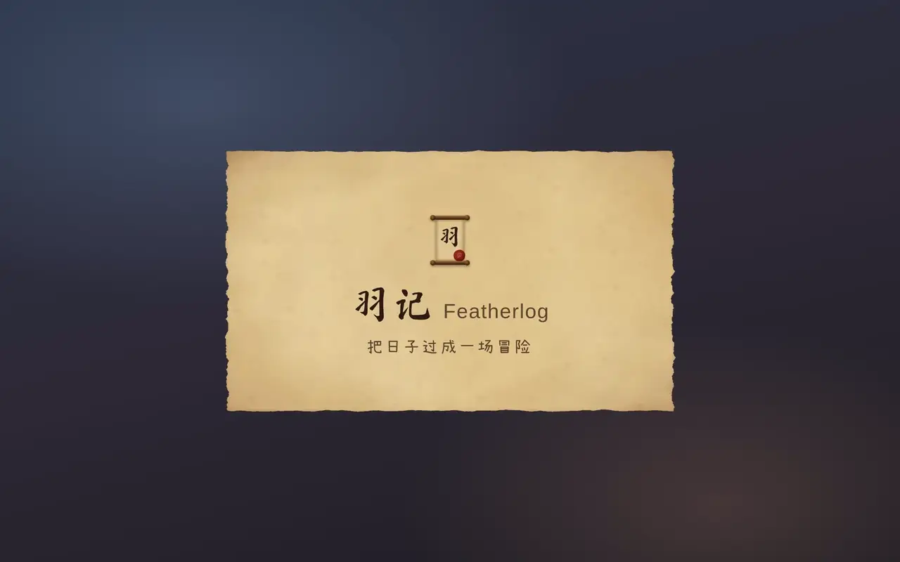
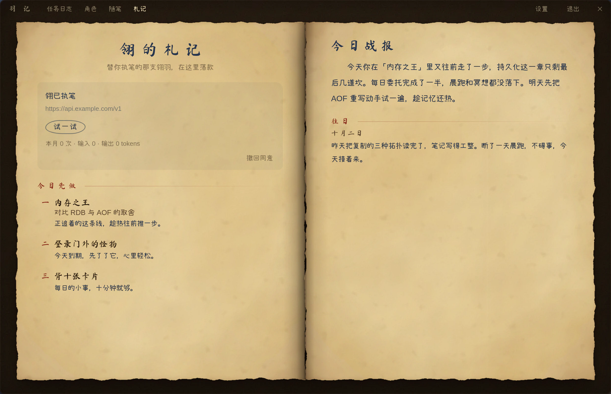
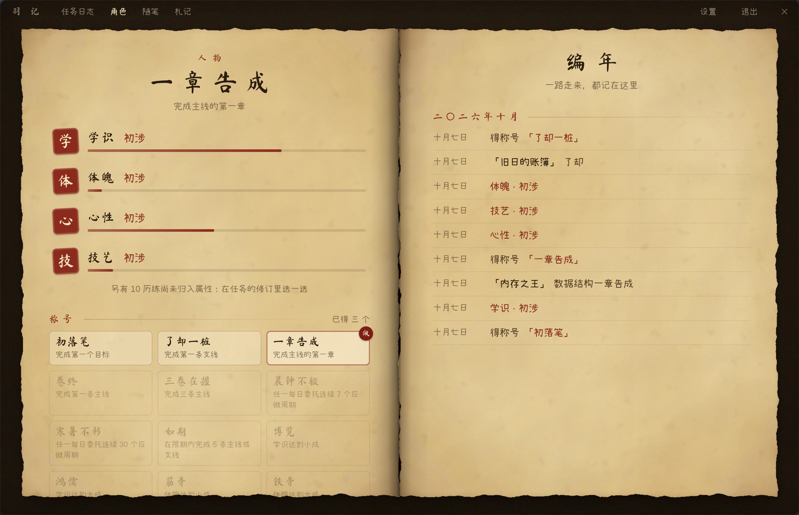
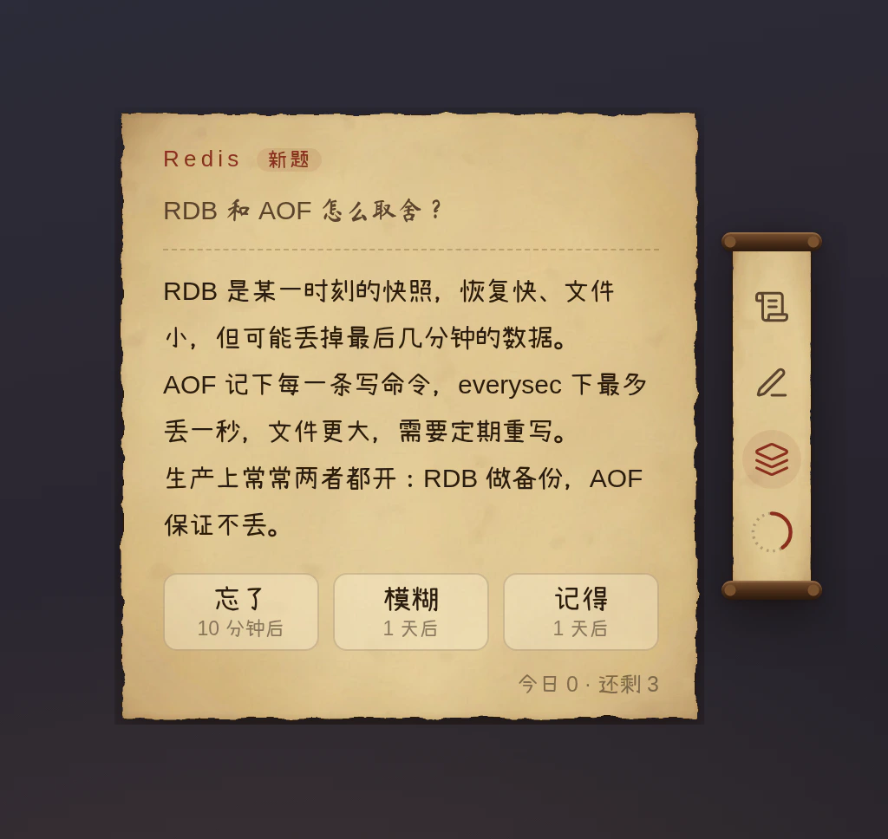

<div align="center">


# 羽记 · Featherlog

**把日子过成一场冒险。**<br/>
一本羊皮纸任务日志，收在桌面边上的一只小卷轴里。

[](https://github.com/muyuzhong/Featherlog/releases/latest)
[](https://github.com/muyuzhong/Featherlog/actions/workflows/ci.yml)
[](#下载安装)
[](LICENSE)

[下载](https://github.com/muyuzhong/Featherlog/releases/latest) · [设计文档](docs/design.md) · [写一个插件](examples/flashcards/README.md) · [参与开发](#开发)

<br/>

<a href="docs/images/promo.mp4"></a>

<sub>四十秒看一遍羽记 · <a href="docs/images/promo.mp4">高清视频</a></sub>

</div>

<br/>

## 不是待办清单，是任务

待办清单只会越列越长。羽记借用了游戏里"任务"的样子：同一时间只追踪一件事，眼前只摆着**下一步**。


- **主线**：一条任务线，分成若干章，每章若干目标，**按顺序一个个解锁**。还没走到的部分藏在"尚未揭晓"后面。整条线和每一章都可以有自己的限期。
- **支线**：一件单独的事，可以拆几步，也可以就是一件事。
- **每日委托**：每天（或每周几）重来一次的习惯，可以设配额，比如"背十张卡片"。断了不罚，接着来就是。
- **追踪**：给一个任务盖上火漆，它的当前目标就会出现在卷轴里。
- **手感**：下一个目标像墨水洇开一样浮现；一章写完钟声响起，一个任务完成时盖下朱印「功成」。落笔、翻页、盖火漆都有声音，在设置里可以调小或关掉。

每个任务都有一个**真实目标**（"背完 Redis 八股"），也可以起一个**任务名**（"内存之王"）、写几句**简报**，再挑一两项它锻炼的**属性**。

<table>
  <tr>
    <td width="36%" valign="top">
      
      <p align="center"><b>浮动的卷轴</b><br/><sub>置顶在屏幕边上，拖到哪里都行。<br/>悬停时朝屏幕中间展开便签，<br/>点一下翻开日志。</sub></p>
    </td>
    <td width="64%" valign="top">
      
      <p align="center"><b>在日志里落笔</b><br/><sub>新建和修订都在右页进行，排版就是它将来被读到的样子。<br/>回车起新目标，修订不丢进度。</sub></p>
    </td>
  </tr>
</table>

## 翎：替你执笔的书记官

翎是住在这本日志里的老书记官，话少、干脆，带一点冷幽默。你落笔，它在页边回一句；你卡住了，它出个主意；一条主线走完，它替你写下尾声。它的字用偏蓝的墨色，和你自己的字一眼就能分开。

- **一句话立项**：在便签上"对翎说"一句"这个月把 Redis 八股背完"，它起草一份分好章节的任务，摆在编辑稿纸上让你改。**翎只提议，落笔的永远是你。**
- **即时回应**：完成目标、写完一章、了结一个任务时，页边多一句批注，一笔一笔写出来。话多话少可以调，夜里不主动开口。
- **今日先做与今日战报**：每天第一次打开时建议先做哪三件事；到了晚上，写一页今天的战报。
- **卡住了**：一个目标五天没动静，它提议拆成几步更小的。
- **尾声**：任务完成后，尾声留在「功成」下方；一条主线完成时，翎还会为它题一个称号。



**模型由你自己配置**，不预设任何服务商：选 OpenAI 兼容接口或 Anthropic Messages API，填上地址、模型名和密钥即可；本地模型也行（`localhost` 允许 `http://`）。札记页里可以"试一试"连接，并查看本月用了多少 token。

> [!IMPORTANT]
> 翎**默认关闭**。第一次启用时，它会先说清楚哪些内容会发给你配置的接口：任务的标题、目标、简报和最近的进展。随笔永远不发；手记只有在你打开"让翎读我的手记"之后才发。翎只访问你填的那个地址，它说过的话只存在本机。
>
> 密钥交给系统的密钥库加密保存（macOS 钥匙串、Windows DPAPI、Linux 上的 KWallet 或 GNOME 钥匙环），不进设置文件。Linux 上找不到密钥库时，羽记拒绝保存，而不是退回明文。

## 角色：做完的事，变成一个人的样子

四项属性：**学识**、**体魄**、**心性**、**技艺**。完成目标、章节、任务和每日委托，都会在任务挂的属性上攒下历练，一路从「初涉」走到「入门」「小成」「精熟」「大成」，直至「化境」。

- **称号**：固定的成就（初落笔、卷终、晨钟不辍……），没得到的也写着条件，像一面成就墙；翎为每条完成的主线题的称号也收在这里。挑一个佩戴在名字上。
- **编年**：按月记下完成的每个任务、每一章、每次境界提升和每个称号，写下就不再改。
- **没有金币，没有商店**：历练只增不减，也不能花；撤回一个目标不扣，再完成一次也不会多给。完成目标时不飘"+10"，成长按天、按周在这一页上看。



## 手记与随笔

- **手记**挂在任务上：在任务页上记下这一步做了什么、学到了什么。任务完成后手记还在；任务删了，手记变成随笔，不会跟着丢。
- **随笔**不属于任何任务，有自己的一本，可以翻找，也可以连同手记一起看。
- 卷轴上有一支笔，悬停就能随手记一笔，记作随笔或记到正在追踪的任务上。

## 八股：一个可选插件

<table>
  <tr>
    <td width="44%" valign="top">
      
    </td>
    <td width="56%" valign="top">
      <p>背八股的小卡片，正好填进写代码时等 AI 输出、等编译的空档。</p>
      <ul>
        <li>鼠标移到卷轴上的图标翻一题，按<b>忘了 / 模糊 / 记得</b>安排下次复习，间隔从 10 分钟到 60 天。</li>
        <li>题库在面板的"八股"页里录入，也能批量粘贴或导入 Markdown：<code>##</code> 标题是问题，下面是答案，<code>#</code> 标题是题组。</li>
        <li>默认不启用。在设置的"插件"一节勾选后立即出现；取消勾选就卸下，题库和复习记录都留着。</li>
      </ul>
      <p>它也是编写插件的示例，见 <a href="examples/flashcards/README.md">examples/flashcards</a>。</p>
    </td>
  </tr>
</table>

## 下载安装

从 [**Releases**](https://github.com/muyuzhong/Featherlog/releases/latest) 下载对应的安装包：

| 系统 | 安装包 | 自动更新 |
|---|---|---|
| **Linux** x64 | `Featherlog-<版本>-x86_64.AppImage`，加上执行权限后直接运行 | ✅ 后台下载，退出时安装 |
| **Windows** x64 | `Featherlog-<版本>-x64.exe`，按用户安装，不需要管理员权限 | ✅ 后台下载，退出时安装 |
| **macOS** | Apple 芯片选 `arm64`，Intel 选 `x64`（`.dmg`） | 有新版本时提示前往下载 |
| **Arch Linux** | 仓库里的 PKGBUILD，见下方 | 跟着包管理器更新 |

**AppImage 的 FUSE 依赖**：若运行时报 `libfuse.so.2` 缺失，只有 FUSE 3 还不够；Arch Linux 可安装兼容库 `sudo pacman -S fuse2`，保留现有 FUSE 3。也可以执行 `./Featherlog-<版本>-x86_64.AppImage --appimage-extract-and-run`，或使用下方无需 FUSE 的 PKGBUILD。其他发行版见 [AppImage 官方 FUSE 排错说明](https://docs.appimage.org/user-guide/troubleshooting/fuse.html)。

**Arch Linux**：AUR 目前暂停了新账号注册，上架之前可以直接用仓库里的 PKGBUILD 构建安装。它从 Release 下载同一个 AppImage 并校验，装到 `/opt/featherlog`，不需要 FUSE。每次发版后 PKGBUILD 会随之更新：

```sh
git clone https://github.com/muyuzhong/Featherlog
cd Featherlog/packaging/aur/featherlog-bin
makepkg -si          # 以后更新：git pull，再 makepkg -si
```

> [!NOTE]
> 目前的安装包**没有代码签名**。Windows 首次运行可能出现 SmartScreen 提示，点"更多信息 → 仍要运行"；macOS 需要在"应用程序"里右键选择"打开"。

**隐私**：羽记不需要账号，日志、笔记和角色都存在本机。会联网的只有两处：检查更新，只访问 GitHub，不带任何标识，也不做统计，在设置里可以关掉自动检查；以及你启用并配置之后的翎，只访问你填的接口。

<details>
<summary><b>桌面环境说明</b></summary>

<br/>

- **KDE Plasma（Wayland）**：通过一个很小的 KWin 脚本让卷轴置顶，不需要额外设置。
- **其他 Wayland 桌面**：卷轴可能无法置顶，可以在设置里打开"兼容模式"（改走 XWayland）后重启。混合缩放的多块屏上，兼容模式下可能发糊。
- **Windows、macOS、X11**：直接置顶，并记住卷轴的位置。

</details>

## 开发

需要 Node 22+ 和 pnpm（版本见 `package.json` 的 `packageManager`）。

```sh
pnpm install
pnpm dev          # 浏览器演示台 http://127.0.0.1:5173：真实的内核与插件，不需要 Electron
pnpm app          # 启动 Electron 应用
pnpm typecheck
pnpm test
```

演示台（`packages/playground`）在浏览器里运行真实的内核、全部插件和界面，由一个模拟的外壳代替 Electron 主进程，翎换成一个不联网的替身。工具栏可以切换纸张、把卷轴挪到另一侧、跳到第二天、切换翎是否可用、模拟各种更新结果，还能查看总线上的每一条消息。README 顶部的宣传片也是从演示台录的，界面改了就用 `pnpm --filter @featherlog/playground promo` 重录，见 [packages/playground/promo](packages/playground/promo/README.md)。

### 一切皆插件

内核很小，只负责送信；任务日志、翎、笔记、角色、八股，全都是通过总线收发纯 JSON 消息的插件。插件之间、插件与外壳之间从不互相 import，唯一的接口是 [`packages/contracts`](packages/contracts) 里的类型契约。


| 目录 | 内容 |
|---|---|
| [`packages/contracts`](packages/contracts) | 消息、插件、preload 的类型契约，各方共同的接口 |
| [`packages/kernel`](packages/kernel) | 总线与插件生命周期，没有运行时依赖，Node 和浏览器都能跑 |
| [`packages/shell`](packages/shell) | Electron 外壳：主进程、preload、渲染层的窗口与主题 |
| [`plugins/quest`](plugins/quest) | 任务：主线、支线、每日委托，日志与便签 |
| [`plugins/scribe`](plugins/scribe) | 翎：两种接口的适配器、回应、战报与尾声，札记页 |
| [`plugins/notes`](plugins/notes) | 手记与随笔 |
| [`plugins/character`](plugins/character) | 角色：历练、境界、称号与编年 |
| [`examples/flashcards`](examples/flashcards) | 八股：可选插件，也是编写插件的示例 |
| [`packages/playground`](packages/playground) | 浏览器演示台 |

每个插件都是一个工作区包：`manifest.json` 声明它收发哪些消息、往哪些插槽（卷轴图标、面板标签页、设置小节）里放东西；`src/main/` 在主进程里管数据和规则，`src/ui/` 在每个窗口里画界面。想写自己的插件，照着 [examples/flashcards](examples/flashcards/README.md) 抄一份最快，它的 README 逐项讲了清单字段、`ctx.storage` / `ctx.settings` / `ctx.clock` 的用法、怎样请求别的插件并在它不在时降级，以及怎样写测试。目前只支持仓库内置的插件，新插件在外壳的两个组合根里登记。

完整设计见 [docs/design.md](docs/design.md)：总线语义、插件生命周期、任务模型的每条规则、各平台的浮窗实现、翎、笔记、角色与可选插件，以及发布与更新。

### 协作方式

这个项目由两个 AI 分工协作完成：**Claude** 负责方案设计、契约和全部前端，并审查 PR；**Codex** 负责内核、插件的主进程部分和 Electron 主进程。规则写在 [AGENTS.md](AGENTS.md)：契约只加不改，每条设计规则都要有测试，每个 PR 只做一件事。

<details>
<summary><b>发布新版本（维护者）</b></summary>

<br/>

发版的决定就是合并一个修改 `packages/shell/package.json` 中 `version` 的 PR，之后全部由 CI 完成：

1. 推送到 `main` 后，CI 发现 `v<版本号>` 标签还不存在，就打上标签，准备一个**草稿** Release。
2. 在 Linux、Windows、macOS 上测试、构建，并把安装包上传到草稿。
3. 在 Linux 上实际启动打出的 AppImage，等内核和全部插件加载完再退出（冒烟测试）。
4. 安装包、blockmap 和 `latest*.yml` 齐全、冒烟通过后，自动正式发布并设为 latest；发布说明按上一个正式版本以来合并的 PR 生成。
5. 发布后，CI 开一个 PR 更新 `packaging/aur/featherlog-bin` 的 PKGBUILD 与 `.SRCINFO`。

任何一步失败都停在草稿，不会发布残缺的版本；修好后用新的补丁版本号重发，不复用失败的标签。已安装的客户端只会看到正式发布的版本，草稿和预发布版都不会触发更新。手动推送 `v*` 标签也仍然可以触发发版。

本地打包：`pnpm --filter @featherlog/shell package:app`，产物在 `packages/shell/dist`。

</details>

## 致谢

- 字体：[马善政毛笔楷书](https://fonts.google.com/specimen/Ma+Shan+Zheng)（标题）与 [小赖字体](https://github.com/lxgw/kose-font)（正文），均为 SIL Open Font License。
- 图标：[Lucide](https://lucide.dev)（ISC License），加粗成墨迹。
- 构建在 [Electron](https://www.electronjs.org)、[React](https://react.dev) 与 [Motion](https://motion.dev) 之上。

## 许可证

[MIT](LICENSE)
